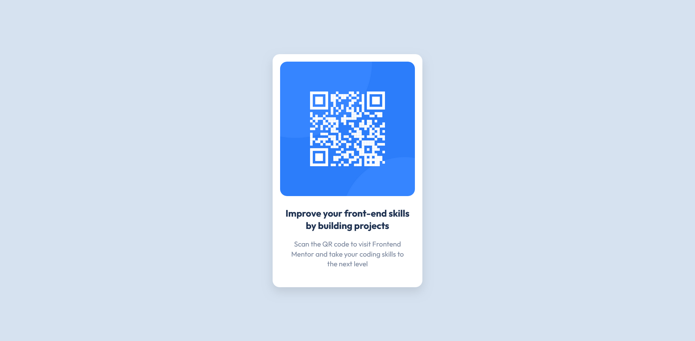

# Frontend Mentor - QR Code Component Solution

This is a solution to the [QR Code Component challenge on Frontend Mentor](https://www.frontendmentor.io/challenges/qr-code-component-iux_sIO_H).  
Frontend Mentor challenges help you improve your coding skills by building realistic projects.

---

## 📋 Table of contents

- [Overview](#overview)
  - [Screenshot](#screenshot)
  - [Links](#links)
- [My process](#my-process)
  - [Built with](#built-with)
  - [What I learned](#what-i-learned)
  - [Continued development](#continued-development)
  - [Useful resources](#useful-resources)
- [Author](#author)
- [Acknowledgments](#acknowledgments)

---

## 🧩 Overview

### About the challenge

The challenge was to build out a **QR code component** and get it looking as close to the provided design as possible.  
Users should be able to:

- View the component centered in the page.
- See hover and focus states for interactive elements (if any).
- View the layout optimally on all screen sizes.

This was a great beginner project to practice **HTML structure**, **CSS styling**, and **component alignment** techniques.

### Screenshot



### Links

- **Solution URL:** (https://www.frontendmentor.io/solutions/)
- **Live Site URL:** (https://github.com/abdinur99/qr-code-component-main/)

---

## 🛠 My process

### Built with

- Semantic **HTML5** markup
- **CSS custom properties**
- **Flexbox** for layout
- **Mobile-first workflow**

---

### What I learned

This project helped me practice layout techniques and understand the importance of spacing, alignment, and simple responsive design.

Here’s a snippet I’m proud of:

```css
body {
  display: flex;
  justify-content: center;
  align-items: center;
  height: 100vh;
  background-color: var(--clr-slate-300);
}
```
